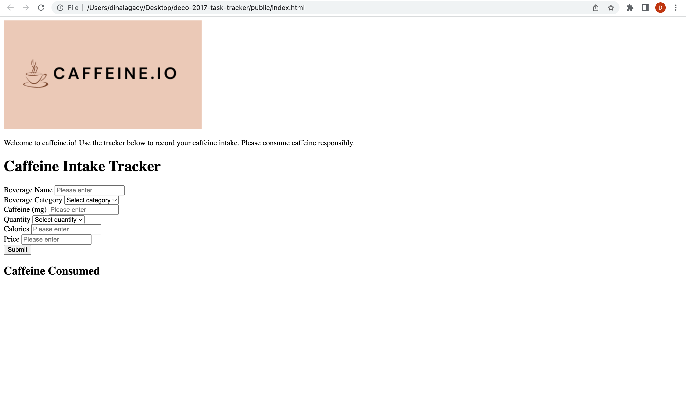
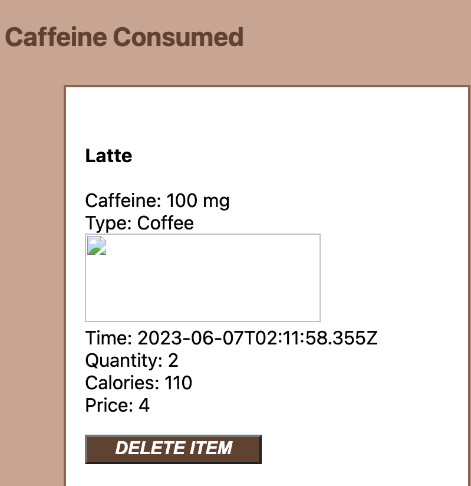
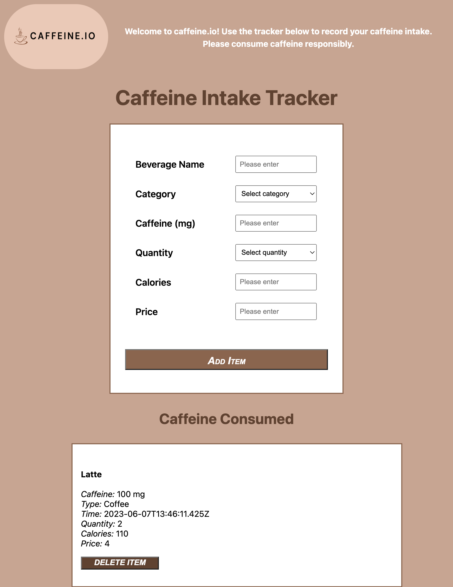
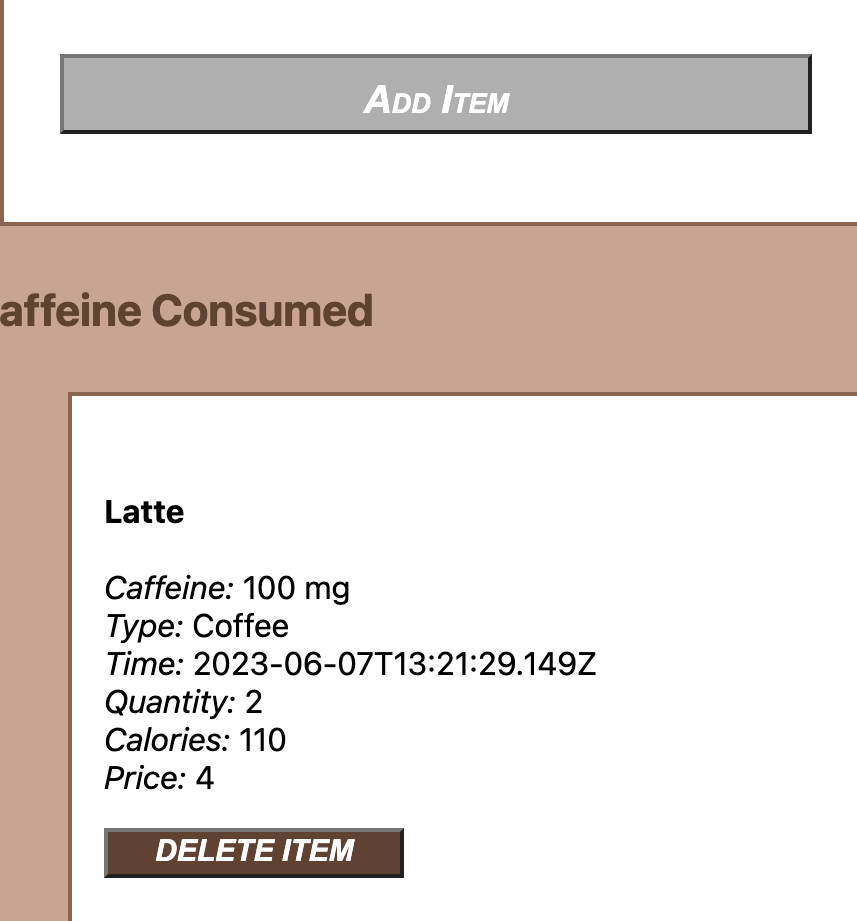

# Task Tracker

**Source code:**
For this tracking application, I cloned and adapted the template repository as provided to the class (found at <https://github.com/robdongas/deco2017-task-tracker>).

**Server:**
This application can be run using parcel, I used the npm run dev command to start the server each time.

**Note:**

***I made many attempts to implement the image functionality and local storage as proposed in the design brief. Unfortunately I could not get this to work and due to time constraints I was unsuccessful, and left the tracker functional in a more stripped down form. I figured it would be better to leave the tracker in a more basic state where it could still be run on its own server, because with the other errors when trying to implement local storage/images it would no longer run at all (particularly when I added the .parcelrc file). I left the code (commented out) from my attempts to adapt it at the bottom of the script.js file. I recognize that this will likely lead to substantial point deductions and I apologise, but I am just aiming for partial marks where possible.***

**Viewport size for mobile/responsive viewing:**
The mobile version of the site is modelled based on an iPhone 12 Pro Max (my personal phone I tested it on), which has a viewport width of 428px.

## Development notes:

**Iteration 1:**

First, I just set up the basic skeleton/form outline for the tracker. This can be linked to commit #921a49f, titled "skeleton." At this point I just focussed on making sure that the tracker had basic functionality working before trying to implement the style as proposed in the design brief. Main functions included adding beverage entries and deleting beverage entries, and ensuring the resulting changes were reflected in the array when logged to the console. 

**Iteration 2:**

Following the basic skeleton set up, I began styling the page in the second iteration. I changed the colour scheme of the page to be earthy/brown tones to resemble that of coffee to go along with the theme of caffeine. I tried to use accessibility-friendly contrast between elements, such as white backgrounds for the tracked beverages against the brown of the page. 

At this point I just did basic styling features such as font styles/weights/sizes, and logo reshaping (from sharp to rounded corners). At this stage the form was not formatted very cleanly, for example, the labels for each input were flush to each input box/not aligned in a specific manner. I took care of this in the next iteration. 

Most of my efforts during this iteration were to implement the image feature as proposed in the design brief. I struggled to do so with parcel, and kept having an issue as shown in the screenshot below, where images would not show up after using an img tag inside of item.innerHTML in my script.js file. I tried to follow all of the steps as stated on piazza for using images along with parcel but could not figure it out unfortunately. Particularly when I used the code given to be placed inside of the .parcelrc file, my server stopped working completely. I ended up forgoing this feature in order to ensure my server would still work/display the basic tracking functionality I was able to implement. 

**Iteration 3:**

In this iteration, after attempting to implement the image functionality, I went back to paying attention to other style elements that needed work. To make my form more aesthetically pleasing I aligned my input boxes and input labels in a uniform manner. I did so by creating separate divs for my input labels and input boxes, then flex displaying them as columns. 

I also centered my form and tracked beverage sections, as they were awkwardly aligned in iteration 2 (with the tracked beverages being flush to the left side of the page instead).

I also implemented other style elements I had proposed in the design brief, such as changing button colours and cursor styles when hovered over to act as a signifier. The "Add Item" button shown below is how the buttons appear when hovered over (grey) versus the normal brown colour.

